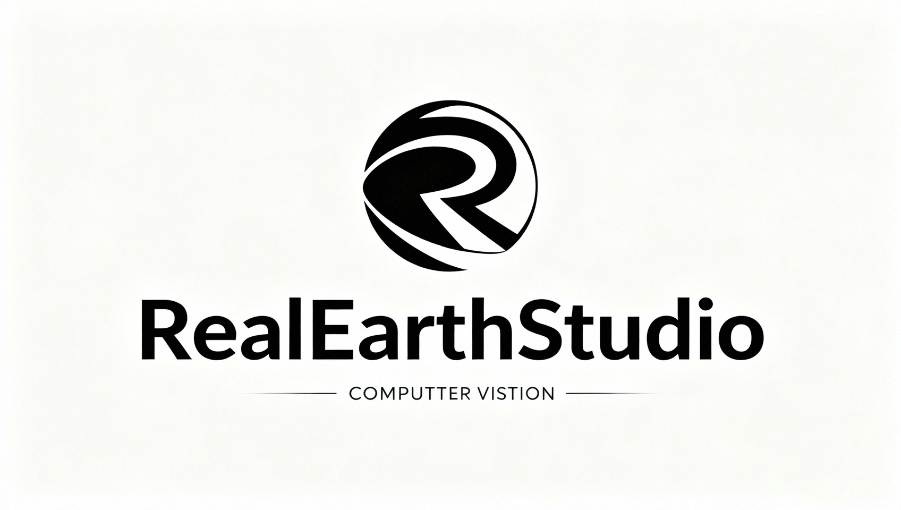

# RealEarthStudio

> 一个用于构建真实地球场景、合成3D数据并渲染高质量图像的开源工具集。


---

## 📦 一、简介

**RealEarthStudio** 是一个面向地理空间仿真与合成数据生成的 Python 工具库。它支持：

- 🧱 **多模型合并**：将建筑、道路、车辆等 `.fbx` 模型组合成完整城市场景
- ☀️ **太阳光照控制**：通过方位角、高度角精确设置自然光照
- 🖼️ **高质量渲染**：按照固定仰角旋转渲染输出 RGB 图像 + 目标标注
- 🗺️ **地理对齐**：支持 WGS84 坐标系与局部坐标转换

适用于特定目标检测数据集生成等场景。



---

## ⚙️ 二、安装

### 2.1 依赖要求

- Python = 3.11
- Blender = 5.0

### 2.2 安装步骤

#### （1）克隆项目

```bash
git clone https://github.com/CharlesWYQ/RealEarthStudio.git
cd RealEarthStudio
```

#### （2）创建Django环境并安装依赖 (Anaconda)

```bash
conda create -n realearthstudio_env python=3.11
conda activate realearthstudio_env

pip install -r requirements.txt
```

#### （3）创建FiftyOne环境并安装依赖 (Anaconda)

```bash
conda create -n fiftyone_env python=3.11
conda activate fiftyone_env

pip install fiftyone

# 查找FiftyOne环境解释器地址
conda run -n fiftyone_env python -c "import sys; print(sys.executable)"

# 将上述地址复制到 ./RealEarthStudio/setting.py 中
FIFTYONE_ENV = r"<FiftyOne环境解释器地址>"
```

#### （4）安装MySQL和Redis数据库

安装完毕后在 `./RealEarthStudio/setting.py` 中修改MySQL数据库信息。

#### （5）迁移数据库
```bash
# 迁移数据库
python manage.py makemigrations
python manage.py migrate

# 创建管理员账号
python manage.py createsuperuser
```
